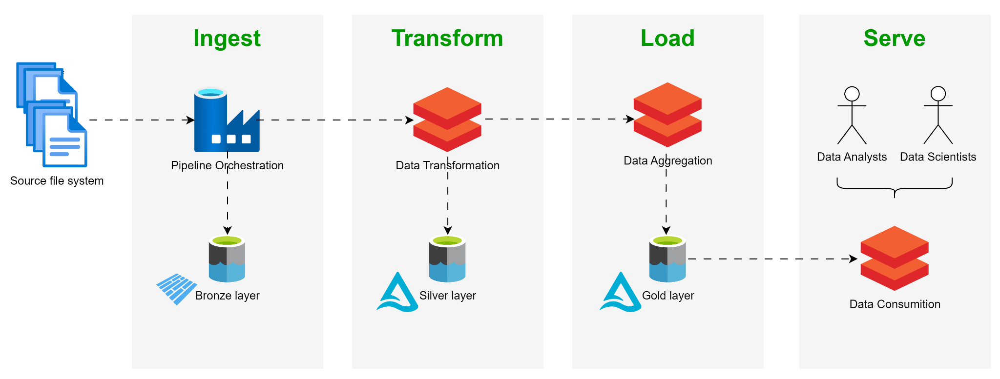
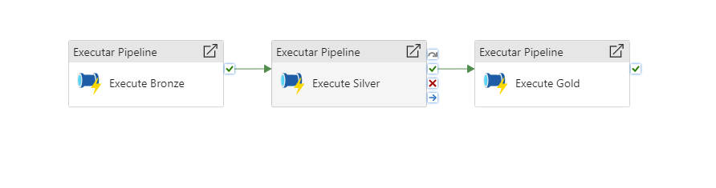
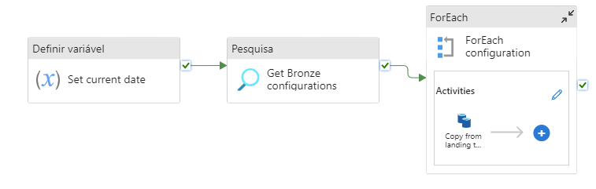
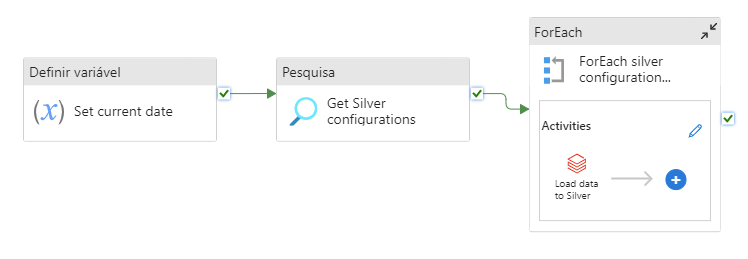
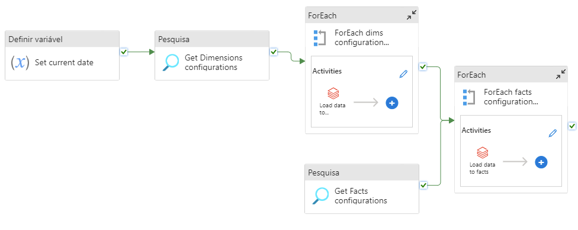
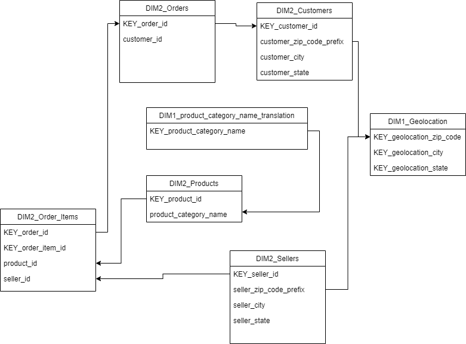

# Introduction

The main purpose of this case study is to create a scalable and easily maintainable data solution that integrates data from multiple sources and delivers it to Data Analysts and Data Scientists teams in a well-structured, readable, and efficient manner.
The solution will focus on building a data lakehouse architecture based on the Medallion data layers Bronze, Silver and Gold, along with implementing a Star Schema in the Gold
layer.
The project stack will involve Azure technology, specifically using Azure Data Factory, Azure Data Lake, and Azure Databricks resources.

This solution will include the following resources and corresponding deliverables:
- Azure Data Factory: this resource will be responsible for orchestrating and triggering the process according to the required frequency, in this case, daily. The deliverables will include six JSON files: one for the pipeline, two for the datasets, two for the linked services and one for the trigger, along with screenshots to visually represent them.
- Azure Data Lake: this resource will be responsible for data storage. It will be structured as follows:
    - one container is designated for configuration files, where it will store JSON files containing metadata configurations for data ingestion into Medallion data layers;
    - one container is designated for the Landing zone, where raw CSV format files will be stored to simulate the source system;
    - one container is designated for the Bronze layer, where raw Parquet format files will be stored in folders separated by data source and data ingestion date (e.g., bronze/olist/2024-03-09/customers);
    - one container is designated for the Silver layer, which will store data in delta table format (e.g., silver/customer);
    - one container is designated for the Gold layer, which will store data in delta table format in a star schema (e.g., gold/dim2_customers).
The deliverables will consist of screenshots representing the file system in each data layer.
- Azure Databricks: this resource will be responsible for data processing across all data layers. The deliverables will be two PySpark scripts: one for cleaning, transforming, and loading data between the Bronze and Silver layers dynamically, and another for aggregating and loading data between the Silver and Gold layers dynamically.

# Data Lakehouse architecture

Overall process is built in Azure technology using Azure Data Factory, Azure Data Lake, and Azure Databricks.
The first step is to ingest the source files into Azure Data Lake through Azure Data Factory pipelines.
The second step is to transform and clean data into delta tables through Azure Databricks notebooks.
The third step is to load data into delta tables through Azure Databricks notebooks.
Finally, the Data Analysts and Data Scientists will be able to access the data using Azure Databricks SQL or notebooks.

The pipeline executes the main pipelines:
- Landing2Bronze.json, where the data is loaded into Bronze layer;
- Bronze2Silver.json, where the data is loaded into Silver layer;
- Silver2Gold.json, where the data is loaded into Gold layer.

## Ingestion

The ingestion process consists of loading data from the Landing layer, which is simulating the source system such as a SFTP, into the Bronze layer.
To support the loading, the configuration file LoadToBronze.json contains a mapping between the source file path and file name, and the target file path and file name. This is mainly for the process to know which files need to load and where to load.

## Transform

The transformation process is where the data is clean, data types are aligned, and record duplications are discarded. This step has the help of the configuration file LoadToSilver.json where it contains the notebook's name to be executed. In this case, we loaded every file into Bronze layer, but since the team only needs a set of those files, Silver layer only contains the necessary tables.

## Load

The loading process is where the data is arranged according to dimensional data modeling so the team can access it the most clean and fast way.

Currently, the data model has dimensions, which can be connected as follows:

# Conclusion

Overall the process is ready to dynamically load a CSV file into a delta table, making the process robust and efficient.
Also, by making the process dynamic, it makes a smooth transition to production.

Some improvements came be made:
- Add logging process tracking, to ensure that the process runned successfully;
- Add a fact table.